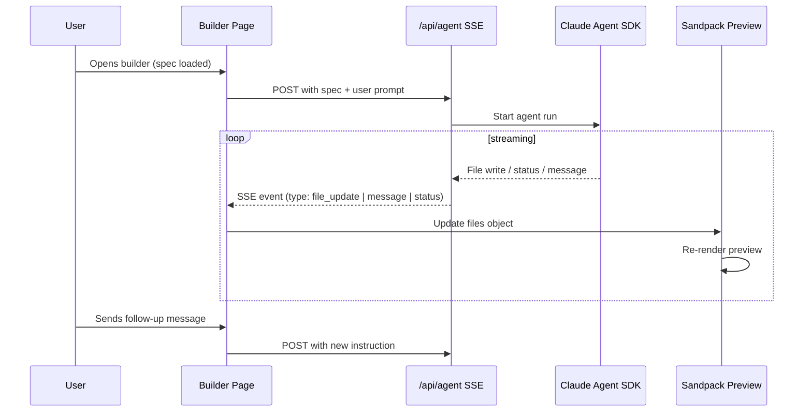
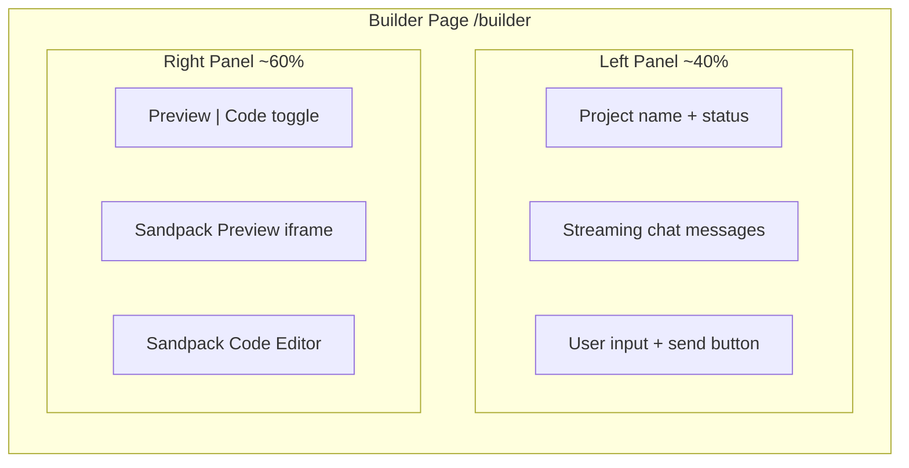

# Lovable-Style App Builder

## Architecture Overview




## UI Layout (mirrors Lovable)




The left panel shows a scrolling chat feed of agent actions (thinking, writing files, errors) plus a text input for follow-up instructions. The right panel shows a live Sandpack preview with a toggle to view the raw code/file tree.

## Key Implementation Details

### 1. Install Sandpack

Add `@codesandbox/sandpack-react` to `frontend/`. Sandpack takes a `files` prop (object mapping file paths to content) and re-renders the preview instantly when files change. No deploy, no server -- it runs entirely in-browser via an iframe'd bundler.

### 2. New Builder Page: `frontend/src/app/builder/page.tsx`

A new route (not inside the existing dashboard tabs) with a full-viewport split layout:

- **Left panel (chat)**: Renders an array of `Message` objects (`{role: 'agent'|'user', content: string, type: 'thinking'|'file_write'|'message'|'error'}`). Auto-scrolls. Bottom-pinned input bar.
- **Right panel (preview)**: `SandpackProvider` + `SandpackPreview` for the live view, `SandpackCodeEditor` behind a "Code" tab. A file tree sidebar inside the code view.
- **Resizable split**: Use a simple CSS `resize` or a lightweight splitter (no extra dep needed -- a draggable divider with `onMouseDown`/`onMouseMove` is ~30 lines).

### 3. State Shape

```typescript
interface BuilderState {
  files: Record<string, string>;   // "/App.tsx" -> content
  messages: Message[];
  status: 'idle' | 'running' | 'complete' | 'error';
  projectName: string;
}
```

Managed via `useReducer` in the builder page. SSE events dispatch actions that update files and append messages.

### 4. SSE API Route: `frontend/src/app/api/agent/route.ts`

A Next.js Route Handler that:

- Accepts POST with `{ prompt: string, spec: string }`.
- Starts the Claude Agent SDK run (or for now, a mock that streams fake file events).
- Returns a `ReadableStream` with SSE-formatted events:
  - `event: message` -- agent thinking / status text
  - `event: file_update` -- `{ path: "/App.tsx", content: "..." }`
  - `event: status` -- `{ status: "complete" }`
- The frontend connects via `EventSource` or `fetch` + stream reader.

For the initial build, this route can be **mocked** (streams a hardcoded sequence of file writes with delays) so the UI can be developed and tested without the full Claude Agent SDK wired up.

### 5. Spec Loading

The builder page receives the spec via a query param or reads it from a known location. For now:

- The user navigates from the home page prompt -> the prompt is sent to the API -> the API (or a prior step) writes `spec/app.md` -> the builder page loads it.
- Simplest approach: pass the spec content as part of the POST body to `/api/agent`. The home page `page.tsx` stores the prompt in URL state or a simple context, and the builder page reads it.

### 6. Entry Point from Home Page

Modify `[frontend/src/app/page.tsx](frontend/src/app/page.tsx)`:

- On "Launch Run" click, navigate to `/builder?prompt=<encoded_prompt>`.
- The builder page reads the prompt from searchParams, sends it to the SSE endpoint.

### 7. Files to Create / Modify


| Action | File                                                                                             |
| ------ | ------------------------------------------------------------------------------------------------ |
| Create | `frontend/src/app/builder/page.tsx` -- main builder layout                                       |
| Create | `frontend/src/components/builder/ChatPanel.tsx` -- left panel chat feed + input                  |
| Create | `frontend/src/components/builder/PreviewPanel.tsx` -- right panel Sandpack preview + code toggle |
| Create | `frontend/src/app/api/agent/route.ts` -- SSE endpoint (mocked initially)                         |
| Modify | `frontend/src/app/page.tsx` -- wire "Launch Run" button to navigate to `/builder`                |
| Modify | `frontend/src/app/dashboard/page.tsx` -- link App tab to `/builder` if a project exists          |


### 8. Sandpack Configuration

Sandpack will be configured as a React template with Tailwind support:

```typescript
<SandpackProvider
  template="react-ts"
  files={files}
  theme="dark"
  options={{ 
    externalResources: ["https://cdn.tailwindcss.com"],
    showNavigator: true 
  }}
>
  <SandpackPreview style={{ height: "100%" }} />
</SandpackProvider>
```

The `files` object is updated in real-time as SSE events arrive. Each `file_update` event triggers a state update -> Sandpack re-renders.